<div align="center">

# UptimeEZ

### Uptime monitoring that tells you **what to do**, not just what broke.

**Self-hosted website monitoring for people who run other people's websites.**
It catches broken layouts, dead databases hiding behind an HTTP 200, expiring certificates and silent cron
jobs, then hands you a to-do list with the fix one click away.

Zero dependencies · No Docker · Runs on plain shared hosting · SQLite or MySQL · 10 languages

[Why UptimeEZ](#why-another-uptime-monitor) ·
[Screenshots](#see-it) ·
[What it detects](#what-it-actually-detects) ·
[Comparison](#how-it-compares) ·
[Install in 60 seconds](#install-in-60-seconds) ·
[Ask it questions from Claude](#talk-to-it-from-an-agent-mcp) ·
[Documentation](docs/en/README.md) ·
[Version française](README.fr.md)

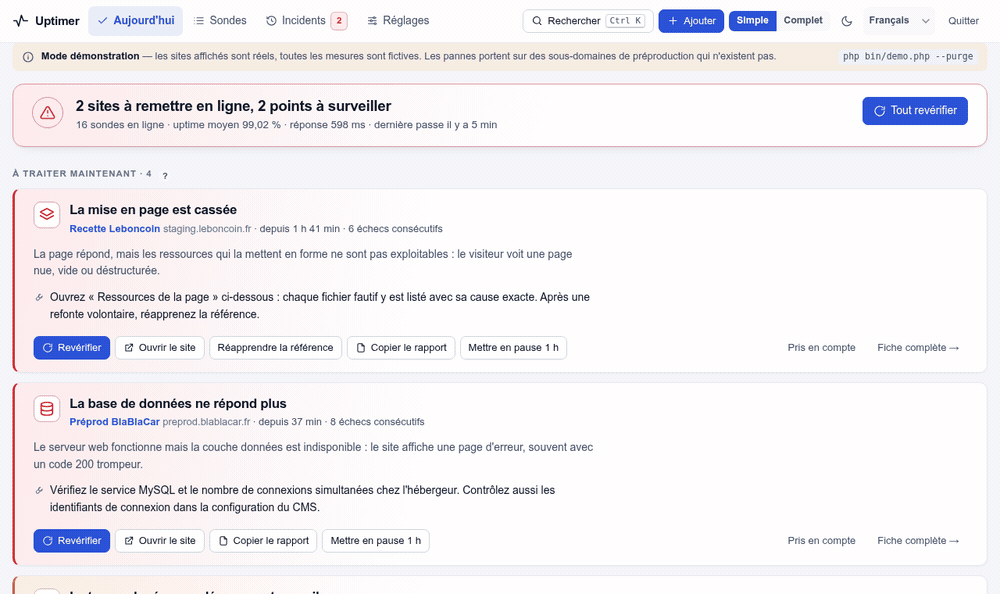

</div>

---

## Why another uptime monitor?

Every monitoring tool on the market answers the same question: **is the site up?**

That question stopped being interesting a long time ago. A site can answer `200 OK` in 180 ms and still be
completely broken: the stylesheet 404s after a deployment and visitors get raw HTML; the database is down and
WordPress serves a cheerful error page with a perfect status code; someone left `noindex` on after a release
and Google is quietly dropping the site.

UptimeEZ was built around three findings from running an agency portfolio on the alternatives:

| What goes wrong with the others | What UptimeEZ does instead |
|---|---|
| **Setup is a tax.** Twenty screens and forty fields before you have monitored anything at all. | You paste a list of domains. It detects the CMS, picks the pages worth following, infers the string that proves the database answers, tunes thresholds from measured p95, then shows a **preview before creating anything**. |
| **Alerts become noise.** One server goes down, forty e-mails arrive. After a week nobody reads them. | Failures sharing an IP become **one grouped alert**. Thresholds tune themselves, so a naturally slow site never cries wolf. Quiet hours, maintenance windows, acknowledgement, retries before alerting. |
| **Dashboards show states, not actions.** Green and red dots; you still have to work out what to do. | The home screen is a **to-do list**: cause, why it matters, what to do, the evidence, and the buttons that do it without leaving the page. Every action is undoable. |

> The others show you **states**. UptimeEZ gives you **a list of things to do**, and guesses everything else.

---

## Everything it watches

Most tools watch one thing: does the server answer. UptimeEZ watches **five layers**, on every page it checks,
without asking you to configure any of them.

| | What it watches | What that catches |
|---|---|---|
| **Does it answer?** | Status code against an expected range, DNS, connect, TLS and first-byte timings, redirect chain, retries before alerting | Downtime, timeouts, a certificate handshake failing, a redirect loop, a site that moved to `www` |
| **Is the page right?** | Every stylesheet, script and font: availability, MIME type, `nosniff`, mixed content, CSP, SRI, weight against a learned baseline, class coverage, media queries, blocks awaiting an animation | A deployment that 404s the CSS, half the stylesheet gone, a responsive layout lost, an *invisible* page |
| **Does the data answer?** | 41 database-failure signatures, a CMS probe that really traverses the database, and a proof string derived from the site's own content | WordPress serving a cheerful error page with a perfect `200`, a truncated table, a full disk |
| **Is it fast for visitors?** | Server response time in milliseconds, render-blocking files with their exact weight, the top-of-page image and its weight, images without dimensions, fonts without `font-display`, third-party scripts. Plus real LCP, INP and CLS with a free Chrome UX Report key | A lazy-loaded hero image, 400 kB of blocking CSS, a page that jumps while loading |
| **Will it break soon?** | Certificate expiry (two-pass TLS inspection), domain expiry over RDAP, published vulnerabilities on the versions detected in the HTML, and a dead-man heartbeat for jobs that must run | An expired certificate on a Saturday, a domain nobody renewed, a plugin with a three-day-old advisory, a backup that stopped silently |

**Five kinds of monitor**, each with its own settings: a **page**, a **JSON API** (field path, expected value,
headers, body, any method), an **asset** (a file that must stay reachable and unchanged), a **keyword** (a text
that must appear, or must never appear), and a **heartbeat** (your script calls UptimeEZ when it finishes; silence
raises the alert).

And what it does with all that: outages sharing one IP become **one** alert, thresholds tune themselves from
measured p95, every decision is written down in a journal you can read, and the home screen turns the whole lot
into a list of things to do.

→ **[Everything it watches, in detail](docs/en/coverage.md)**

---

## See it

<table>
<tr>
<td width="50%" valign="top">

**The day starts here.** One card per problem, most urgent first: cause, consequence, remedy, and the buttons
that apply it in place.

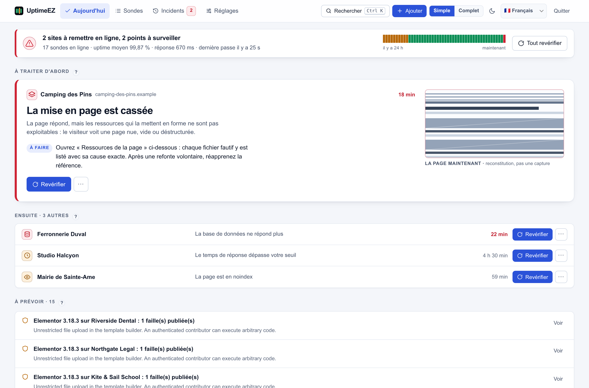

</td>
<td width="50%" valign="top">

**The wall view**, for the screen in the office. Green, orange, red. Sites in trouble float to the top, never
below the fold.

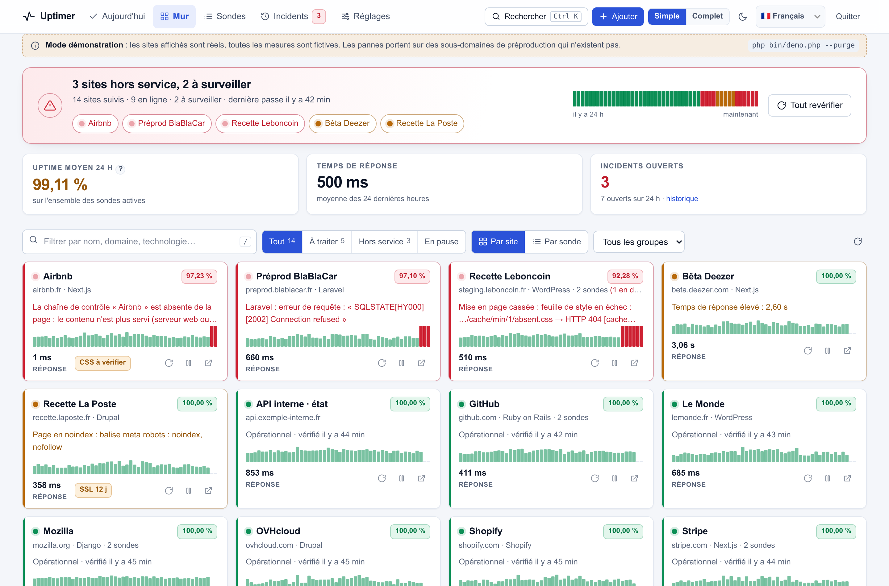

</td>
</tr>
<tr>
<td width="50%" valign="top">

**Broken layout, shown.** Not a number, a picture: the page as a visitor sees it, next to what it used to be,
with the measured difference. Reconstructed from the HTML and the loaded CSS, no browser involved.

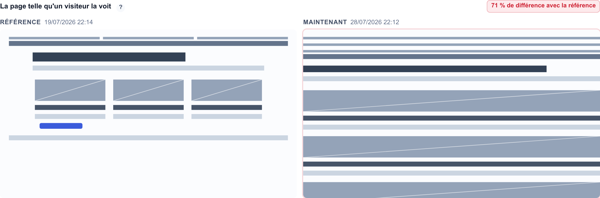

</td>
<td width="50%" valign="top">

**And the exact cause underneath.** Not "CSS looks odd": the failing file, its HTTP status, and the message the
browser console would have printed.

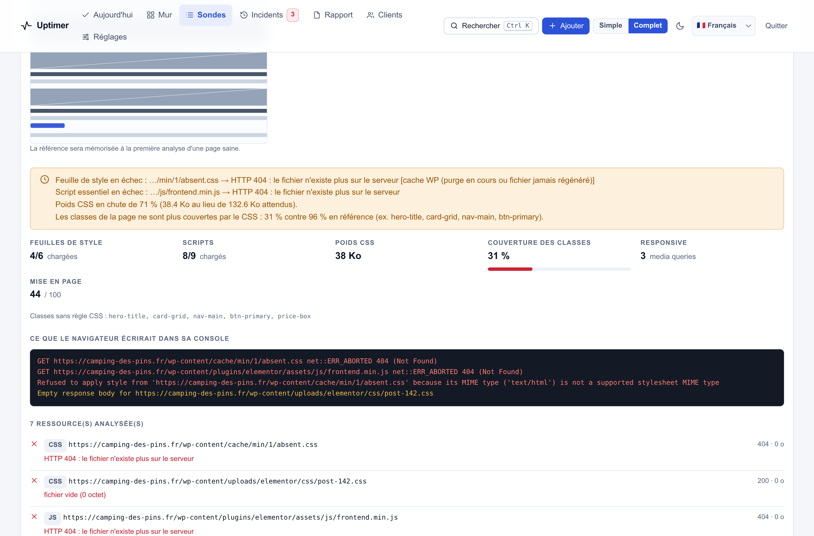

</td>
</tr>
<tr>
<td width="50%" valign="top">

**Nothing hidden, nothing imposed.** One switch moves the whole interface between *Simple*, which shows only
what you can act on, and *Full*, which opens every setting and every measurement.

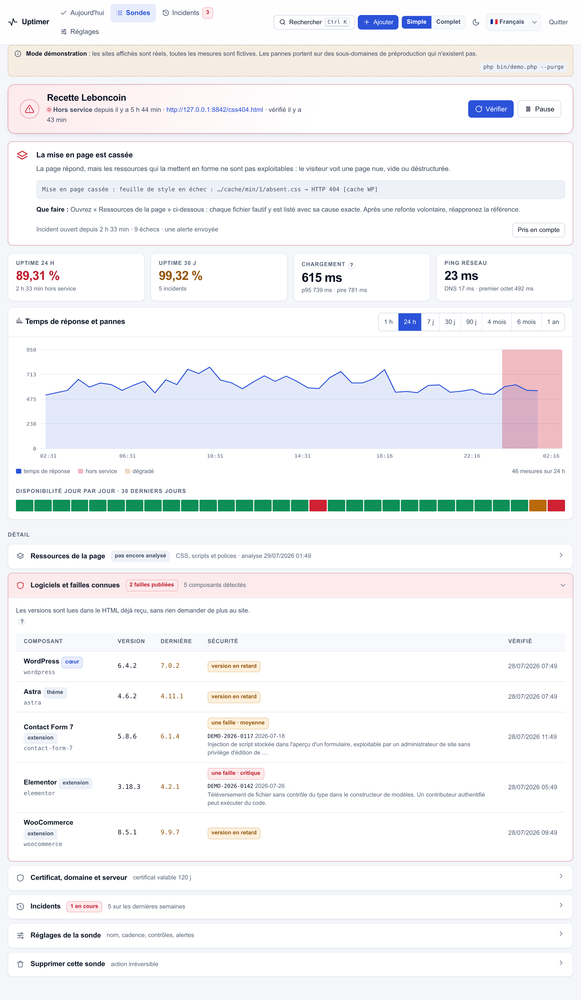

</td>
</tr>
<tr>
<td width="50%" valign="top">

**Ctrl / ⌘ + K.** Any site, any screen, any action. Accent- and case-insensitive in every language: type
`munchen`, find `München`.

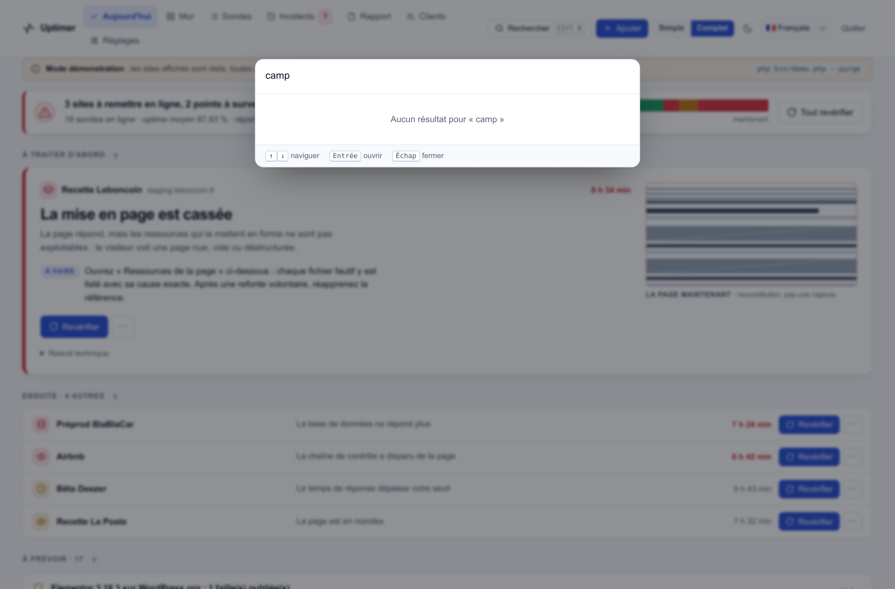

</td>
<td width="50%" valign="top">

**A report you can send to a client.** Availability, outages, response times, day-by-day strip. Print, or save
as PDF.

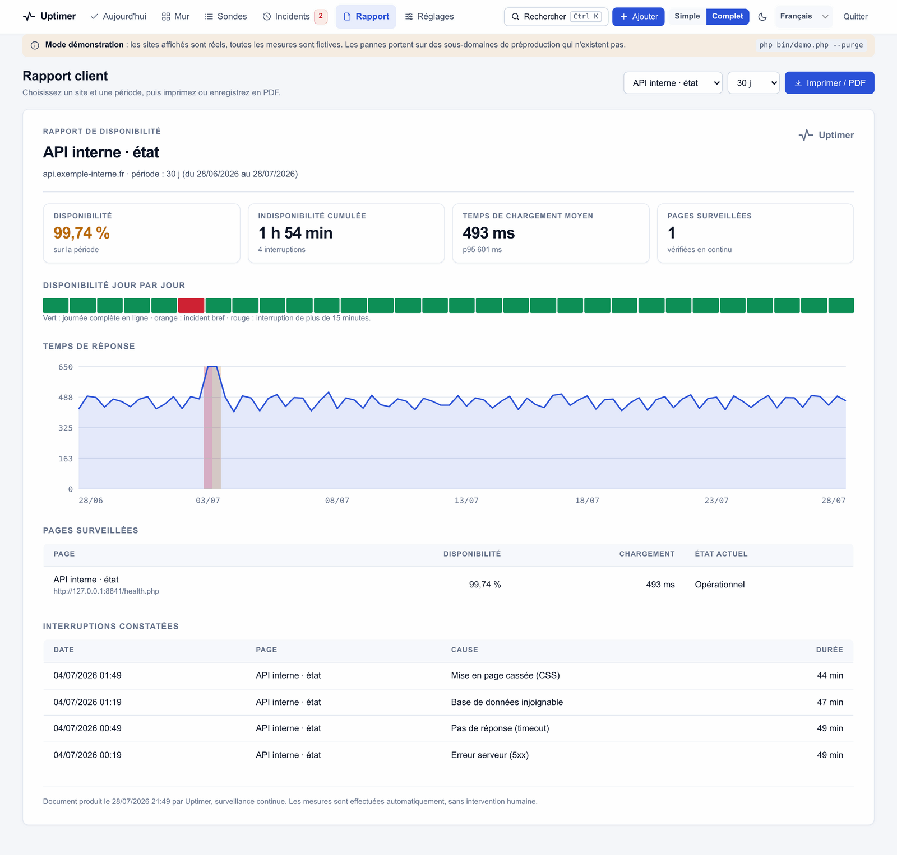

</td>
</tr>
</table>

<details>
<summary><b>More screenshots</b>: dark theme, mobile, other languages, import preview, settings</summary>
<br>

| Dark theme | On a phone |
|---|---|
| 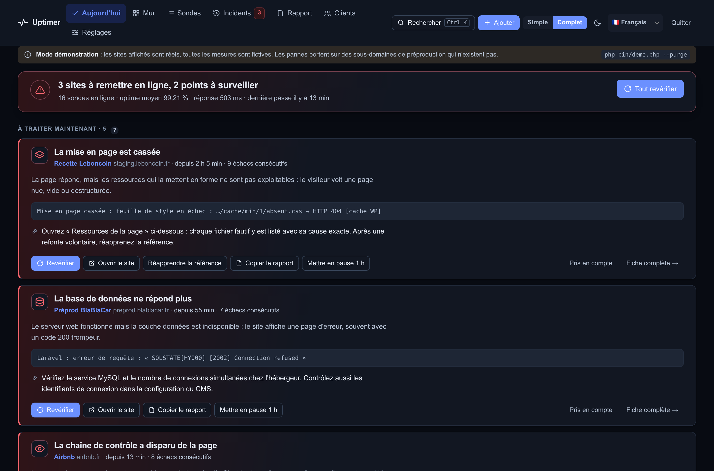 |  |

| English (the default) | Arabic (right-to-left) |
|---|---|
| 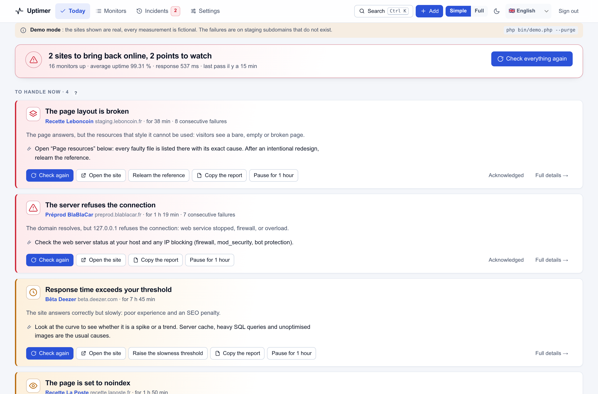 | 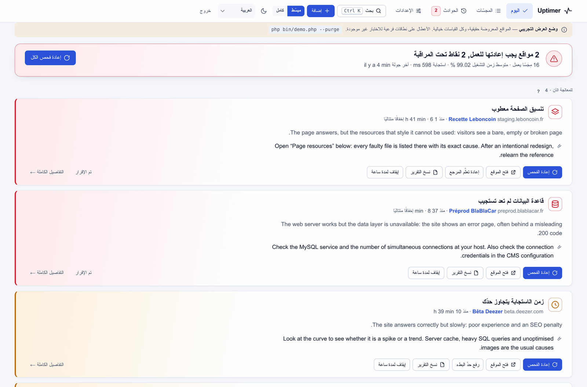 |

**Import: a preview before anything exists.** Paste domains, a spreadsheet, or a client e-mail. UptimeEZ pulls
the addresses out of it and shows exactly what it is about to do.

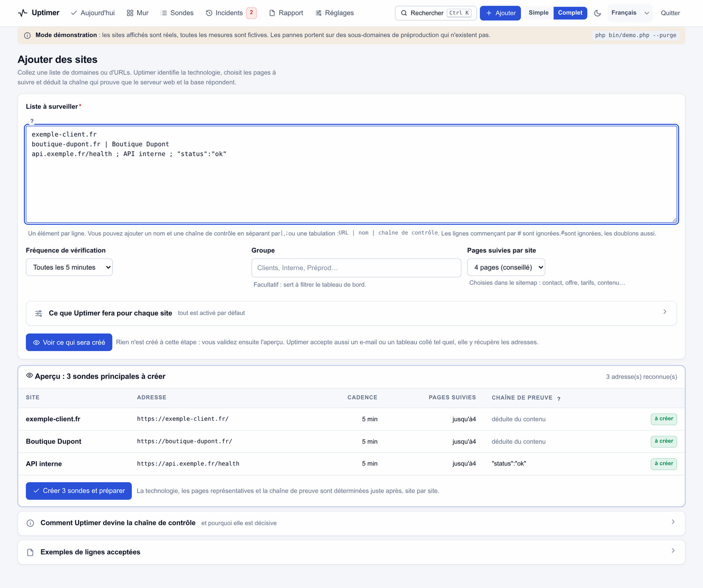

**Settings, folded away.** Everything has a sane default; the accordions stay shut until you need them.

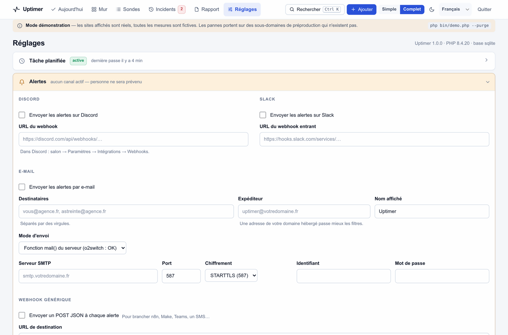

</details>

---

> **About the screenshots.** They come from the bundled demo dataset
> (`php bin/demo.php`). The site names are real and recognisable on purpose, because a screenshot should mean
> something at a glance. **Every measurement is fictional**, the interface says so permanently in demo mode, and
> the four failures sit on staging subdomains that do not exist (`staging.`, `preprod.`, `beta.`, `recette.`).
> Nothing here says anything about the reliability of any real service.

---

## What it actually detects

Most monitors check a status code and a keyword. Here is what UptimeEZ watches, and why each one matters.

### Broken layout, the one nobody else does out of the box

A deployment goes wrong, the minified stylesheet 404s, and your client's site looks like a 1994 text file.
Status code: `200`. Response time: excellent. Every uptime monitor on the market reports that the site is fine.

UptimeEZ crosses **nine independent signals** on every HTML page it checks:

| Signal | What it catches |
|---|---|
| Availability of every stylesheet, script and font | The classic post-deployment 404 |
| MIME type + `nosniff` | Server returns HTML or a PHP trace instead of CSS |
| Mixed content | An HTTP asset on an HTTPS page, silently blocked by the browser |
| CSP `style-src` | A policy change that blocks your own stylesheet |
| SRI `integrity` | A stale hash: the browser refuses a perfectly valid file |
| Volume vs learned baseline | Half the CSS gone without a single 404 |
| Class coverage | Classes in the HTML with no matching CSS rule (tolerant of Tailwind escapes) |
| Media queries | The responsive layout has disappeared |
| Content awaiting animation | Blocks hidden by a reveal script that never loaded, an *invisible* page |

Then it does something no other tool does: it **reconstructs the messages the browser console would have
printed**: `net::ERR_ABORTED`, `Refused to apply style from …`, `Mixed Content: …`, `Failed to find a valid
digest …`. The ticket you hand a developer already contains the evidence.

The baseline is *learned* from healthy states, so an intentional redesign does not page you at 3 a.m., and when
the design does change on purpose, one button relearns it.

### Database down behind a perfect 200

WordPress, Laravel, Doctrine, PDO and Symfony each have a house style for database failures, and all of them
happily return `200 OK`. UptimeEZ carries **41 error signatures**, cross-checks a CMS probe that really
traverses the database (the WordPress REST API, not the cached homepage), and watches the **proof string**: a
piece of text that can only come from the database, such as the footer copyright.

That string is **derived automatically**, in this order of preference: footer copyright, `og:site_name`, page
title, first nav item, H1. It is never taken from an error page. If it vanishes while the page still answers 200, the data layer is
gone and you know within one check.

### Leaving another tool takes five minutes

The obstacle to switching is not the price, it is the evening spent retyping forty monitors. So UptimeEZ reads the
export of the tool you are leaving: **UptimeRobot, Uptime Kuma, Better Stack, Pingdom, Site24x7**, plus a generic
CSV for everything else.

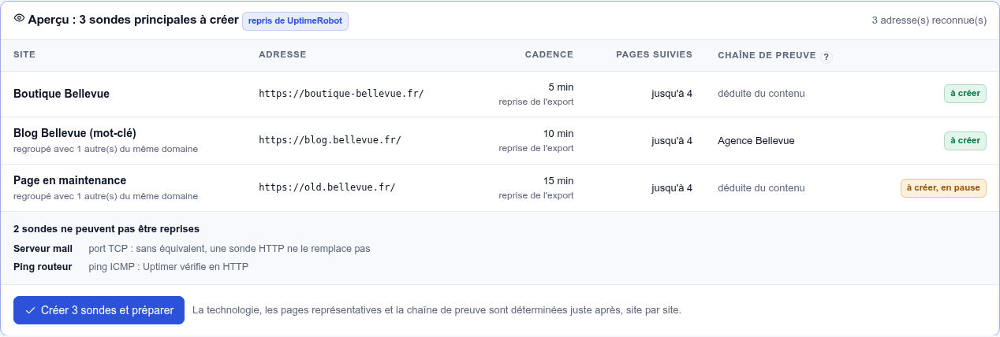

Drop the file. The format is recognised **by its content**, not by its name. Check rates, names, keywords, accepted
status codes, retries and paused monitors carry over as they are, and the preview labels what came from the export
rather than from your defaults.

Two things it refuses to fudge. **Monitors with no equivalent** (TCP port, ICMP ping, DNS, SMTP) are listed with
the reason and not created, because an import that silently loses six monitors out of forty is worse than one that
refuses. And **the keyword direction is honoured per tool**: UptimeRobot's "exists", Kuma's `invertKeyword`, Better
Stack's `keyword_absence` and Pingdom's `shouldnotcontain` all mean "alert when the text is *there*", which becomes
a forbidden string here, not a proof string. Getting that backwards would invert every alert.

**The measurement history is never imported.** It was taken by another tool, with other thresholds, from another
network. A "99.98 %" carried over from Pingdom would say nothing about what UptimeEZ measured, so the counter starts
at zero and the screen says so before you confirm.

→ **[Migrate](docs/en/migrate.md)**

### Why a page is slow, and what to change

Core Web Vitals come from real Chrome browsers. A PHP tool cannot compute them, and UptimeEZ will not pretend
otherwise: no browser measurement is ever invented here. What it does instead is the part nobody else does without
launching Chrome, because it already has the data.

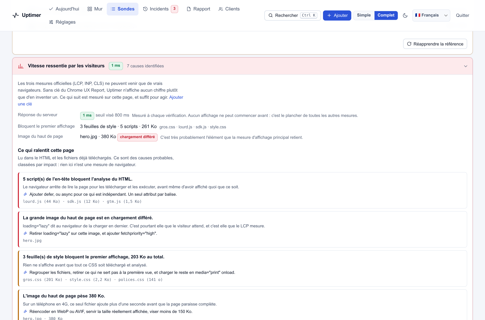

**Measured, not estimated.** Server response time in milliseconds on every check, which is the floor for
everything: LCP will never beat it. The exact weight and transfer time of every stylesheet and script, because the
resource audit already downloads them. The real weight of the top-of-page image, from a single HEAD request.

**Read from the page, and labelled as such.** The stylesheets and scripts that actually block the first paint,
`media="print"` correctly excluded. The top-of-page image marked `loading="lazy"`, which is the most common LCP
mistake there is. Images with no width or height, the leading cause of layout shift. Fonts without
`font-display`. Third-party domains loading script in the head.

Every cause carries its fix, ranked by impact, severity readable off the edge of each row. A finding with no course
of action is just a reproach.

**Field data when you want it.** Add a free Chrome UX Report key and the three official metrics appear next to the
causes, with the worst of the three deciding the verdict, exactly as Google does it. No key, no invented number,
and a page without enough traffic is told so rather than shown a blank.

→ **[Perceived speed](docs/en/speed.md)**

### One link per client, and nothing of anyone else

You monitor thirty sites belonging to twelve people. Each wants to know whether theirs is fine. None of them has
any business seeing the other twenty-nine.

Every other tool answers this with user accounts, roles and permissions. UptimeEZ gives you a client, a checkbox
list of their sites, and a link.

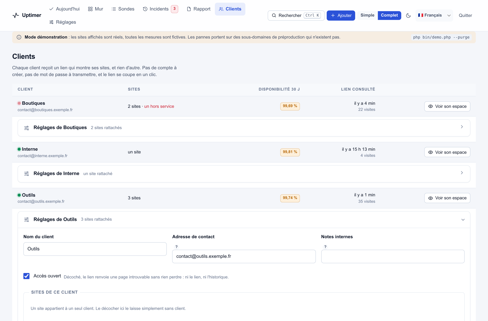

The link opens a page with no account and no password: a band saying **everything is working** or **one of your
sites is not responding**, one block per site with its 24-hour curve and 30-day uptime, and the recent outages
with their duration. No button, no setting, no jargon, and it reads well on the phone where the client will
actually open it.

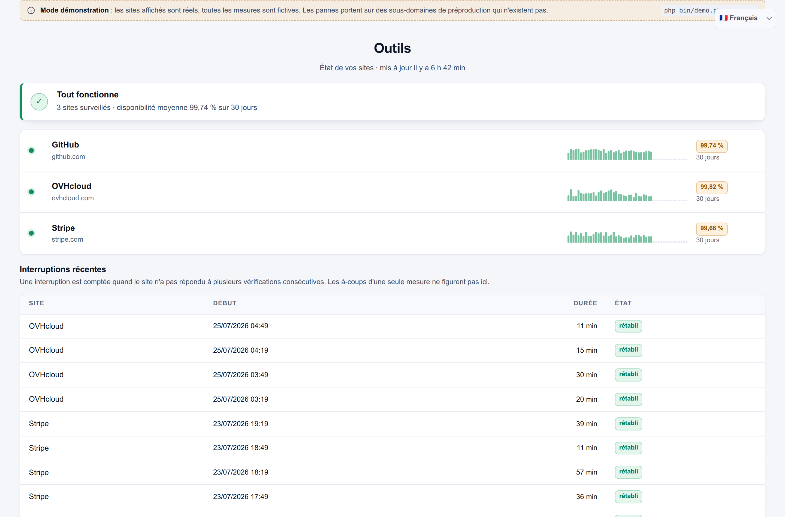

The link is the password, so it is treated like one: a 128-bit random token, `noindex` and `no-referrer` on the
page, `no-store` caching, one click to change the link if it travelled too far, and one switch to close the access
without losing the history. An unknown link, a malformed link and a closed link return **the same response**, so
probing reveals nothing.

Partitioning is not a display concern: every read filters on the client, and no identifier from the URL enters
those queries. Appending `&client_id=7` to someone's link changes nothing. The test suites check exactly that,
hostile tokens included.

Already grouped your sites at import time? One button turns those groups into clients.

→ **[Agency mode](docs/en/agency-mode.md)**

### Vulnerable versions, before anything breaks

UptimeEZ already reads the HTML of every page it checks, and that HTML almost always says which version is
running: the `generator` tag, the `?ver=` parameter on static files, the plugin paths. So it builds a **software
inventory of every site** at no extra cost, then crosses it with public advisory databases: **OSV.dev** for
Packagist (Drupal, Laravel, Symfony, TYPO3, Magento, PrestaShop, Joomla) and **api.wordpress.org** for the
WordPress core, its plugins and its themes.

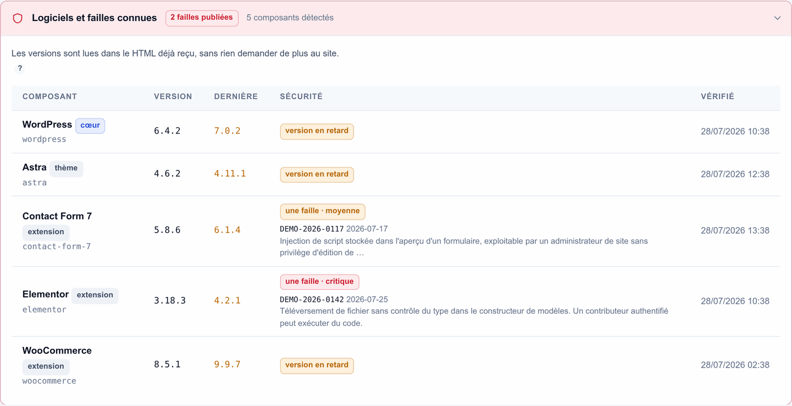

Two signals, and they are never mixed up:

| | |
|---|---|
| **Published vulnerability** | An identified advisory covers *exactly* the detected version. Identifier, date and link are shown. Nothing is inferred. |
| **Behind latest** | The installed version is older than the latest release. Technical debt, not a vulnerability, and it is worded differently. |

A tool that shouts "vulnerable" when it only knows "not up to date" gets ignored within three weeks, and the day
it is right nobody is looking. So severity is only ever displayed when an advisory announced one, an unreadable
version means no lookup instead of a guess, and updating a site resets the verdict immediately.

One lookup per component and per version, cached seven days, capped per maintenance pass: a hundred sites do not
produce a hundred requests a day. What leaves your server is the component name and its version number, never
the address of the site concerned, and the whole thing switches off in one click.

→ **[Security watch](docs/en/security-watch.md)**

### Certificates, domains, and everything else

| | |
|---|---|
| **TLS certificate** | Two-pass inspection: a permissive read for the facts, a strict browser-like validation for the verdict. Expiry, chain, authority, domain match, with warning before expiry. |
| **Domain expiry** | Daily RDAP check. An expired domain kills the site *and* the e-mail, and can be bought by someone else. |
| **Forgotten `noindex`** | The silent SEO killer after a release. Nobody notices for weeks. |
| **Content changes** | A fingerprint of the visible text: catches a publication going live, and a defaced page. |
| **JSON APIs** | Field path, expected value, custom headers, request body, any method. |
| **Silent cron jobs** | A dead-man heartbeat: your backup script calls UptimeEZ when it finishes. **Silence raises the alert**, the one failure no HTTP request can ever see. |
| **Response time** | DNS, connect, TLS, first byte, total. Threshold tuned from the site's own measured p95, not a round number. |
| **Grouped outages** | Ten sites failing on one IP is *one* incident, not ten alerts. |
| **Monthly client report** | Availability, outages, response times, e-mailed to each client on the day you choose. Once a month, never twice, retried the next day if the mail server was down. |

---

## How it compares

Feature comparison against the tools people actually evaluate. This reflects **out-of-the-box behaviour on
standard plans, as of July 2026**: no scripting, no plug-ins, no add-ons. Found a mistake? Open a pull
request; the table lives in this file.

| | **UptimeEZ** | UptimeRobot | Checkly | Site24x7 | Uptime Kuma | Zabbix | New Relic |
|---|:--:|:--:|:--:|:--:|:--:|:--:|:--:|
| Broken layout / CSS detection | ✅ automatic | ❌ | ⚠️ write a browser script | ⚠️ defacement only | ❌ | ❌ | ⚠️ write a synthetic script |
| Browser-console errors reconstructed | ✅ | ❌ | ⚠️ in script logs | ❌ | ❌ | ❌ | ⚠️ in script logs |
| Before / after picture of the broken page | ✅ silhouette | ❌ | ⚠️ screenshot in a script | ⚠️ screenshot | ❌ | ❌ | ⚠️ screenshot |
| Software inventory of each site, versions included | ✅ from the HTML already fetched | ❌ | ❌ | ⚠️ with an agent | ❌ | ✅ with an agent | ⚠️ with an agent |
| Published vulnerability on the detected version | ✅ OSV + wordpress.org | ❌ | ❌ | ⚠️ separate product | ❌ | ⚠️ build it yourself | ⚠️ separate product |
| Database down behind a 200 | ✅ signatures + proof string | ⚠️ manual keyword | ⚠️ manual assertion | ⚠️ manual keyword | ⚠️ manual keyword | ⚠️ build it yourself | ⚠️ manual assertion |
| Proof string inferred automatically | ✅ | ❌ | ❌ | ❌ | ❌ | ❌ | ❌ |
| Forgotten `noindex` alert | ✅ | ❌ | ⚠️ script | ❌ | ❌ | ❌ | ⚠️ script |
| Import from a competitor's export | ✅ 5 tools, auto-detected | ❌ | ❌ | ⚠️ CSV of URLs | ⚠️ its own backup | ❌ | ❌ |
| Says what it could not import, and why | ✅ | n/a | n/a | ❌ | ❌ | n/a | n/a |
| Bulk add with CMS detection and auto-setup | ✅ paste anything | ⚠️ CSV, no detection | ❌ code-first | ⚠️ CSV | ❌ one by one | ❌ | ❌ |
| Preview before monitors are created | ✅ | ❌ | ❌ | ❌ | ❌ | ❌ | ❌ |
| Core Web Vitals with the causes explained | ✅ measured + read from the page | ❌ | ⚠️ Lighthouse score only | ⚠️ score only | ❌ | ❌ | ⚠️ score only |
| Render-blocking files named, with their weight | ✅ | ❌ | ⚠️ in a report | ❌ | ❌ | ❌ | ⚠️ in a report |
| Lazy-loaded top-of-page image detected | ✅ | ❌ | ❌ | ❌ | ❌ | ❌ | ❌ |
| Self-tuning slowness threshold | ✅ from p95 | ❌ fixed | ❌ fixed | ❌ fixed | ❌ fixed | ⚠️ build it yourself | ⚠️ baselines, paid tiers |
| Journal of the tool's own decisions | ✅ | ❌ | ❌ | ❌ | ❌ | ❌ | ❌ |
| Home screen is a to-do list with fixes | ✅ | ❌ dashboard | ❌ dashboard | ❌ dashboard | ❌ dashboard | ❌ dashboard | ❌ dashboard |
| The broken page shown inside the to-do list | ✅ | ❌ | ❌ | ❌ | ❌ | ❌ | ❌ |
| Whole-portfolio 24 h pulse in one strip | ✅ | ❌ | ❌ | ⚠️ per monitor | ❌ | ⚠️ build it yourself | ⚠️ per app |
| Undo on every action | ✅ | ❌ | ❌ | ❌ | ❌ | ❌ | ❌ |
| Outages grouped by server IP | ✅ automatic | ❌ | ❌ | ⚠️ dependency config | ❌ | ✅ topology | ⚠️ config |
| Dead-man heartbeat (cron, backups) | ✅ | ✅ | ⚠️ | ✅ | ✅ push | ✅ | ⚠️ |
| Printable client report | ✅ built in | ⚠️ paid plans | ❌ | ✅ | ❌ | ⚠️ | ✅ |
| Monthly report e-mailed to each client on its own | ✅ | ❌ | ❌ | ⚠️ internal only | ❌ | ❌ | ⚠️ internal only |
| Per-client read-only access, no account to create | ✅ one link | ⚠️ status page only | ❌ | ⚠️ user accounts | ⚠️ status page only | ❌ | ⚠️ user accounts |
| Client sees only their own sites | ✅ by construction | ❌ | ❌ | ⚠️ role configuration | ❌ | ⚠️ build it yourself | ⚠️ role configuration |
| Public status page | ✅ | ✅ | ✅ | ✅ | ✅ | ❌ | ⚠️ |
| Simple / Full interface switch | ✅ | ❌ | ❌ | ❌ | ❌ | ❌ | ❌ |
| Interface languages | **10 + RTL** | 1 | 1 | several | many (community) | several | several |
| Runs on plain shared hosting | ✅ PHP only | SaaS | SaaS | SaaS | ❌ Node/Docker | ❌ server | SaaS |
| Dependencies to install | **none** | n/a | Node + browsers | n/a | Node or Docker | server + DB + agent | agent |
| Your data stays on your server | ✅ | ❌ | ❌ | ❌ | ✅ | ✅ | ❌ |
| Cost for 40 sites | **free** | paid tier | paid tier | paid tier | free | free | paid tier |

**Where the others are genuinely better.** Checkly for scripted end-to-end journeys in CI; Zabbix for
infrastructure metrics on servers you own; New Relic for application tracing inside your code; Site24x7 for
breadth if you want a single vendor for everything; SiteGuru for SEO auditing, which is a different job
entirely. UptimeEZ does not try to be any of those. It does one thing: **keep other people's websites alive
without a full-time human watching dashboards.**

---

## Install in 60 seconds

**Requirements:** PHP 8.2 or newer with `curl`, `pdo_sqlite` (or `pdo_mysql`) and `json`. Verified on 8.2, 8.3,
8.4 and 8.5, by running all ten suites on each. That is the whole
list. No Composer, no Node, no Docker, no build step.

```bash
# 1. Put the files where your web server can serve them
git clone https://github.com/coeurduweb/uptimeez.git
cd uptimeez

# 2. Open install.php in a browser and choose a password.
#    On shared hosting: upload by FTP, then visit https://yourdomain.com/uptimeez/install.php

# 3. One cron entry, every minute, whatever your check intervals are
* * * * * /usr/bin/php /path/to/uptimeez/cron.php >/dev/null 2>&1
```

UptimeEZ picks the monitors that are due itself, so a single per-minute pass covers every interval from 30
seconds to a day. No crontab access? The settings screen hands you a URL to call from any external scheduler.

**Want to look around first? There is a demo mode.** It builds a 13-site portfolio on recognisable domains,
30 days of history, and the four flagship failures: broken layout, dead database, slowdown, forgotten
`noindex`.

```bash
php bin/demo.php                  # password: demo1234
php -S 127.0.0.1:8390 -t .        # then open http://127.0.0.1:8390/
php bin/demo.php --purge          # removes it, leaves no trace
```

Demo mode is not a different build: it is the real application on invented data. A permanent banner says so on
every screen, and it refuses to run over an existing installation.

**[Full documentation](docs/en/README.md)**: installation, o2switch and cPanel specifics, monitor types, alert
channels, the detection engine explained, the CLI, translations, and troubleshooting.

---

## Talk to it from an agent (MCP)

UptimeEZ ships an **MCP server**, so Claude Code, Claude Desktop or any MCP client can ask it questions and act
on the answers. It is written in PHP like everything else: the MCP server is not the one piece that suddenly
demands Node.

```json
{
  "mcpServers": {
    "uptimeez": {
      "command": "php",
      "args": ["/path/to/uptimeez/bin/mcp.php"],
      "env": { "UPTIMEEZ_CONFIG": "/path/to/uptimeez/config.php" }
    }
  }
}
```

Then you can simply ask:

> *"What is broken on the client portfolio this morning?"*
> *"Why is the Deezer beta slow? Show me the trend over 30 days."*
> *"Add these twelve domains, but show me what you would create first."*
> *"The Leboncoin staging redesign is intentional, relearn its reference and check it again."*

**Eleven read-only tools** are exposed by default:

| Tool | Answers |
|---|---|
| `status` | Is everything fine? Counts, uptime, response time, when the collector last ran |
| `tasks` | The to-do list: cause, why it matters, what to do, the evidence, the available fixes |
| `list_monitors` | Every monitor, searchable, accent-insensitive in any language |
| `monitor_detail` | One site in depth, including the page-resource audit and the automatic decisions |
| `incidents` | Outages over a period, with total downtime, for an SLA answer |
| `report` | The ready-to-send report for a ticket or a client e-mail |
| `response_time_series` | The curve, to tell a spike from a trend |
| `web_vitals` | Perceived speed: field measurements and the causes read from the page, kept separate |
| `security_advisories` | Which sites run a version covered by a published advisory, worst severity first |
| `list_clients` | Every client, their sites, their state, and whether they still look at their space |
| `security_target_check` | Would this address be refused before any request? |

**Four more with `--write`**: `check_now`, `apply_fix`, `set_enabled`, `add_sites`. Read-only is the default on
purpose, because an agent that is exploring should not be able to pause a monitor by accident. `add_sites`
defaults to `dry_run`, so the agent shows you the preview before anything exists.

---

## Built to be trusted

A monitoring tool that lies to you is worse than no monitoring tool. So the detection logic is tested against
real failures, and the interface is tested in a real browser.

```
php bin/selftest.php      1,121 checks   detection logic, offline, no network needed
php bin/bench.php          73 checks   real failures reproduced end to end (incl. badssl.com)
php bin/e2e.php           287 checks   full user journey over real HTTP, isolated instance
node bin/e2e-browser.mjs  105 checks   real Chromium: rendering, keyboard, mobile, contrast
php bin/chaos.php          35 checks   859 hostile requests from a user doing everything wrong
php bin/security.php      126 checks   OWASP Top 10, three depths, against a hostile local site
php bin/infra.php          61 checks   UptimeEZ itself down: what it says, and what it never leaks
php bin/mysql.php          43 checks   the MySQL / MariaDB driver, on a real server
php bin/mcp.php            n/a         MCP server for agents (27 of the checks above exercise it)
php bin/deadcode.php       n/a         unused methods, functions, classes, CSS, msgids, files
php bin/i18n-audit.php     n/a         translation coverage, per language
```

**1,851 checks, all green**, plus zero dead code and a complete default catalogue.

Four suites deserve a word.

**`bin/chaos.php`** plays a user who types badly, clicks everywhere, ignores every instruction, submits empty
and monstrous forms, and actively tries to break things: SQL injection, XSS, path traversal, 5 KB inputs, arrays
where strings are expected, exotic HTTP verbs. The contract it verifies is not "it works" but **"it never
breaks"**: no 500, no PHP notice leaking onto the page, nothing the user typed reflected into the HTML, and a
consistent database afterwards.

**`bin/security.php`** audits at three depths, every check labelled with its OWASP reference:

| Depth | What it does |
|---|---|
| **1, light** | Configuration, secrets, cookie flags, exposed surface, dependency surface, static injection review |
| **2, deep** | OWASP Top 10 as *active* tests on a live isolated instance: unauthenticated access to every screen and API action, forced browsing to source files, path traversal, CSRF on every write, 11 SQL-injection payloads across 5 parameters, reflected / stored / attribute XSS, response-header injection, session fixation, brute-force lockout, logout invalidation |
| **3, very deep** | What targets the collector itself: SSRF (a monitored site that redirects to `file://`), XXE through a hostile sitemap, a 40 MB response, pathological content against the regexes, constant-time token comparison, indistinguishable heartbeat responses, spreadsheet formula injection, dynamic SQL identifiers |

**`bin/infra.php`** checks that UptimeEZ knows how to fall over. A tool whose job is to say "this site is broken,
here is why" has no business returning a blank page when it is the one going down. Eight infrastructure failures
are provoked for real — `data/` not writable, a corrupt database, a read-only file, a MySQL server that is off,
stale credentials, a `config.php` that is unreadable, broken, or not returning an array — and each one has to
satisfy three requirements: a correct response code (503 "try again", not 500), the cause **named** with the
command that fixes it for the signed-in operator, and **nothing technical** for a public visitor. A status page
must never display "Access denied for user 'someone'@'localhost'".

**`bin/mysql.php`** runs the MySQL driver against a real server, with `ONLY_FULL_GROUP_BY` on. Every other suite
works on SQLite, because a throwaway file makes each test isolated and instant; the consequence stayed invisible
for a long time: the MySQL driver was documented, and offered by the installer, without a single line ever
having run on it. Two defects were hiding there, both impossible to see on SQLite. The suite skips cleanly when
no test database is configured: nobody needs a MySQL server to contribute.

That is the point of having them.

---

## Under the hood

```
uptimeez/
├── index.php · api.php · cron.php · beat.php · install.php    entry points
├── src/
│   ├── Runner.php            the collector: curl_multi, retries, incidents, alerts
│   ├── Check/Css.php         the nine layout signals + console reconstruction
│   ├── Check/Database.php    41 database-failure signatures (35 database + 6 fatal PHP)
│   ├── Check/Ssl.php         two-pass certificate inspection
│   ├── Detect/Cms.php        technology fingerprinting
│   ├── Detect/Discovery.php  page selection + proof-string derivation
│   ├── Triage.php            turns states into a to-do list
│   ├── Diagnose.php          25 causes → what it means, what to do
│   ├── Tune.php              self-tuning thresholds + decisions journal
│   ├── Heartbeat.php         the dead-man switch
│   ├── Fail.php              UptimeEZ's own failure: cause, remedy, and nothing public
│   └── I18n.php              10 languages, RTL, plural rules
├── lang/                     one catalogue per language
├── views/                    templates, no framework, no build
├── assets/                   one CSS file, one JS file, no dependency
└── bin/                      the eight test suites, demo data, i18n audit
```

**Design constraints, on purpose:**

- **No dependency, ever.** A monitoring tool that stops working because a package was unpublished is not a
  monitoring tool. Everything is PHP standard library.
- **Shared hosting is a first-class target.** Parallel checks via `curl_multi`, daily rollups so history stays
  cheap, work spread across cron passes. It runs on o2switch, cPanel, Plesk, or a €3 VPS.
- **SQLite by default**, MySQL when you outgrow it. Schema upgrades are automatic and non-destructive.
- **No emoji as icons.** One hand-drawn SVG set, consistent stroke.
- **The interface is the product.** Progressive disclosure everywhere: accordions that remember their state, a
  sticky save bar, contextual help behind a `?`, a command palette, keyboard shortcuts, and a Simple mode that
  hides everything you are not going to touch.
- **Security is a suite, not a claim.** Password hashing, CSRF on every write, session renewal on login,
  rate-limited login, `noindex` everywhere, an installer that locks itself, a heartbeat endpoint that cannot be
  enumerated, and an optional guard against private-range targets for the SSRF surface a URL-fetching tool
  inevitably has. All of it verified by `bin/security.php`, not asserted in a README.

---

## Roadmap

The [backlog](BACKLOG.md) holds the competitor research and the user stories behind each decision. Next up:

- A daily digest instead of per-event alerts, for people who prefer one e-mail

---

## Contributing

Issues and pull requests welcome, particularly these:

- **Translations.** Nine catalogues cover the operating interface; longer help texts fall back to English.
  `php bin/i18n-audit.php --manquants=xx` lists exactly what a language is missing.
- **Detection signatures.** A CMS or framework whose failure mode we do not recognise yet makes a good issue.
- **Corrections to the comparison table.** If a competitor gained a feature, say so and it gets fixed.

House rules: no dependency, no build step, French for the source strings (they are the msgids), a test for
anything that could regress, and comments that explain *why* rather than restate the code.

## Licence

MIT. Use it, sell services around it, fork it.

<div align="center">
<br>
<b>UptimeEZ</b>. Because "the site is up" was never the question.
<br><br>
<sub>uptime monitoring · website monitoring · self-hosted monitoring · PHP monitoring tool · shared hosting
monitoring · broken CSS detection · database down detection · SSL certificate monitoring · cron job monitoring
· dead man's switch · status page · UptimeRobot alternative · Uptime Kuma alternative · agency website
monitoring</sub>
</div>
