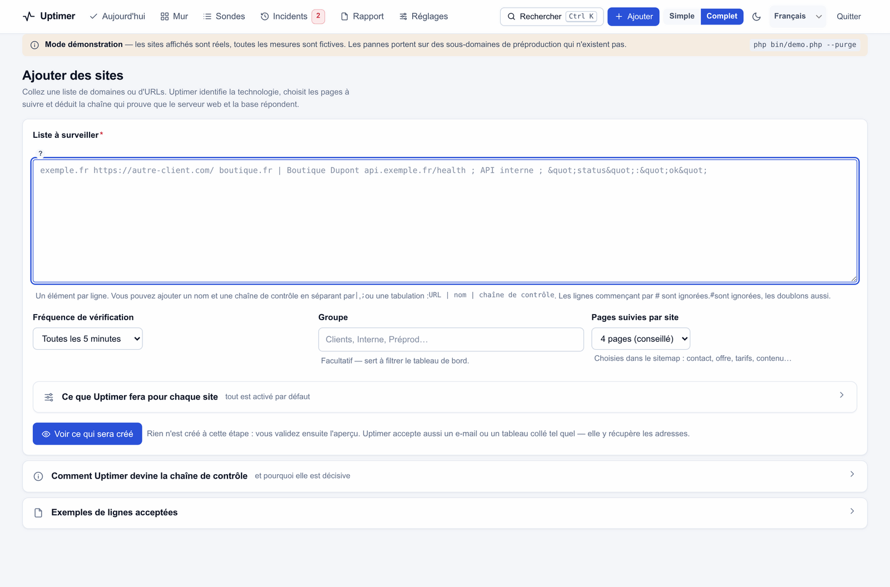

# Prise en main

[← Installation](installation.md) · [Documentation](README.md) · [Sondes →](sondes.md)

Cinq minutes, et un parc est correctement surveillé.

---

## 1. Ajoutez vos sites — collez, ne remplissez pas de formulaire

**+ Ajouter** accepte ce que vous avez sous la main.

```
exemple-client.fr
https://boutique-dupont.fr/
api.exemple.fr/health ; API interne ; "status":"ok"
```

Il accepte aussi une colonne de tableur, un e-mail de client, ou un paragraphe de prose avec des domaines dedans :
les adresses sont extraites, les doublons écartés, les domaines d'adresses e-mail ignorés, les noms de fichiers
images et documents laissés de côté.

Vous pouvez être explicite quand vous le souhaitez : `url | nom | chaîne de preuve`, séparés par `|`, `;` ou une
tabulation. Les lignes commençant par `#` sont des commentaires.



### Rien n'est créé avant que vous le disiez

Le bouton principal est **Voir ce qui sera créé**. Vous obtenez un tableau : une ligne par site, avec la cadence
retenue, le nombre de pages suivies, la chaîne de preuve surveillée, et si le site existe déjà.


Lisez-le, puis validez. C'est l'étape que tous les autres outils sautent, et c'est celle qui vous évite de créer
quarante sondes fausses en un clic.

### Ce qui se passe ensuite, tout seul

À la passe suivante, pour chaque site, Uptimer :

1. **identifie la technologie** — WordPress, PrestaShop, Shopify, Drupal, Joomla, Wix, Astro, Next.js, Laravel… ;
2. **choisit des pages représentatives** depuis `robots.txt` → sitemap → liens internes : une par famille (contact,
   tarifs, contenu), panier et connexion volontairement écartés ;
3. **déduit la chaîne de preuve** du contenu du site, jamais d'une page d'erreur ;
4. **règle la cadence** selon l'importance de chaque page — les tarifs plus souvent que les mentions légales ;
5. **ajoute les sondes techniques du CMS** là où elles veulent dire quelque chose (sur WordPress, l'API REST, qui
   traverse réellement la base) ;
6. **prend une première mesure**, pour qu'aucune carte n'affiche « jamais vérifié ».

Tout ce qu'il a décidé est écrit dans *Ce que Uptimer a décidé toute seule*, sur la fiche de la sonde en mode
Complet.

---

## 2. Lisez l'écran d'accueil


De haut en bas, et on s'arrête dès que c'est vert.

**Le bandeau** — une phrase : combien de sites à remettre en ligne, combien de points à surveiller, l'uptime
moyen, le temps de réponse, quand la dernière passe a tourné. Si la tâche planifiée n'a jamais tourné, c'est dit
ici, avec le lien pour la configurer. C'est l'erreur d'installation la plus fréquente.

**À traiter maintenant** — une carte par site, les plus urgents d'abord. Chaque carte porte :

- la **cause** en clair (« La mise en page est cassée », pas `CSS_BROKEN`) ;
- **qui et depuis quand**, avec le nombre d'échecs consécutifs ;
- **pourquoi c'est un problème** — la phrase que vous pouvez transmettre à un client ;
- **la preuve** (mode Complet) : le relevé technique brut ;
- **quoi faire**, et les boutons qui le font : revérifier, ouvrir le site, réapprendre la référence, relever le
  seuil de lenteur, adopter l'URL actuelle, copier le rapport, mettre en pause une heure, prendre en compte.

Rien ici ne quitte la page. Chaque action affiche une notification avec **Annuler**.

**À prévoir** — rien n'est encore cassé, mais ça va l'être : un certificat qui expire, un domaine à renouveler, un
site qui a ralenti de plus de 50 % en trois jours, une sonde jamais mesurée, une préparation encore en attente.

**Tout va bien** — le reste, replié sur une ligne, avec une courbe des 24 heures par site.

---

## 3. Choisissez votre niveau de détail

L'interrupteur **Simple / Complet** de la barre du haut change toute l'interface, pas seulement une page.

| | Simple | Complet |
|---|---|---|
| Navigation | Aujourd'hui, Sondes, Incidents, Réglages | ajoute le Mur et le Rapport |
| Cartes de tâches | cause, pourquoi, quoi faire | ajoute le relevé technique brut |
| Fiche de sonde | état, chiffres clés, courbe, ressources, incidents, réglages | ajoute le tableau des mesures, les évènements de contenu, les sondes voisines, le journal des décisions |
| Formulaire de sonde | nom, cadence, contrôles, alertes | ajoute accès, fenêtre de maintenance, canaux par sonde, User-Agent, TLS |

Simple est le défaut. C'est un parti pris : la plupart des gens, la plupart du temps, ont besoin de quatre choses
et pas de quarante. L'interrupteur est à un clic, et il est mémorisé.

---

## 4. Configurez un canal d'alerte

**Réglages → Alertes.** Discord et Slack prennent une URL de webhook et fonctionnent en trente secondes. L'e-mail
utilise la fonction `mail()` du serveur (parfaite sur o2switch) ou du SMTP direct. Le webhook générique envoie du
JSON, pour n8n, Make, Teams ou une passerelle SMS.

Puis appuyez sur **Tester** : un vrai message part par le vrai canal. Un canal que vous n'avez pas testé est un
canal que vous n'avez pas.

Pendant que vous y êtes, trois réglages qui valent trente secondes :

- **Heures calmes** — par exemple `23:00-07:00`. Les alertes « à surveiller » sont retenues ; les vraies pannes
  passent toujours.
- **Prévenir avant l'expiration du certificat** — 14 jours est un bon défaut.
- **Prévenir au rétablissement** — pour savoir que c'est fini sans avoir à regarder.

---

## 5. Mettez le mur d'écran là où on le voit

`Mur` est fait pour un écran avec lequel personne n'interagit : grandes cartes, la couleur d'abord, les sites en
souffrance en haut, rafraîchissement automatique toutes les 30 secondes. Groupez par site ou listez chaque sonde ;
filtrez par groupe si vous séparez les clients des projets internes.


---

## Et ensuite

- **[Sondes](sondes.md)** — une page par option, et quand ça valait la peine d'y toucher.
- **[Détection](detection.md)** — ce que « mise en page cassée » veut dire vraiment, et pourquoi ça n'alerte pas à
  tort.
- **[Alertes](alertes.md)** — routage, regroupement, et comment garder des alertes qui valent la peine d'être lues.
- **[Rapports](rapports.md)** — le rapport client et la page d'état publique.
